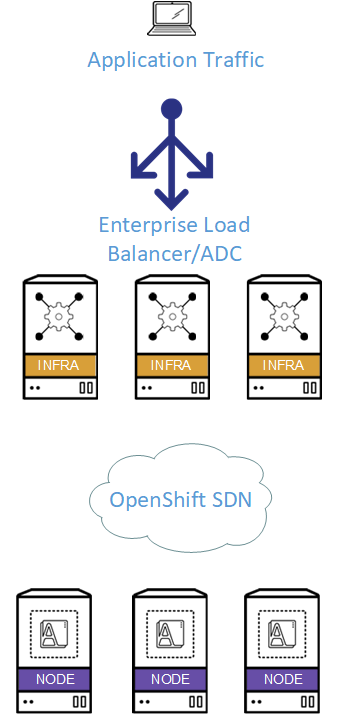
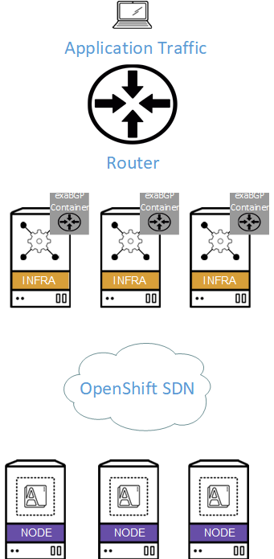

# exaBGP_OpenShift

## Synopsis
One of the critical scaling points for OpenShift is scaling traffic that is ingressing into the cluster.  Historically this has been scaled by adding more router nodes and placing them behind a load-balancer/ADC.

The main drawback to this scaling mechanism is that it can be costly as it requires an enterprise-grade load-balancer/ADC that can be configured/scaled to the requirements of the cluster.

The purpose of this project is to prove scaling can be done without the need for additional expensive network components.

We can achieve this by running exaBGP in containers pinned to router nodes announcing an anycast address.  This allows for n-scale over well established scaling mechanisms (BGP and anycast).

As most organizations that require any kind of data center scale have routers our layer 3 switches running in their enviornment already, this prevents the need for procuring additional hardware to scale the OpenShift environment.

## The Legacy Topology

The legacy topology is scaled by using an enterprise grade load-balancer/ADC for ingress (the same is for Admin/API nodes).  The drawback here is that load-balancers are expensive, and introduce another scaling chokepoint, as well as another administrative domain.

## The New Topology

The new topology is scaled by running exaBGP containers on each of the ingress points (Infrastructure/Admin/API nodes) and pinning it to that node.  The exaBGP containers peer with the upstream router(s) and all announce an anycast address.  Almost every enterprise with a significant infrastructure has some sort of router or layer-3 switch, so additional cost for equipement outside of the OpenShift envioronment is eliminated.  Also, because we are scaling via BGP each exaBGP container can peer to multiple routers, giving full mesh and increasing scaling and redundancy.

## Setup overview
1.  Create templated exaBGP config file with appropriate settings:
  * Neighor address for the upstream router
  * Remote AS
  * Local AS
  * Address to be advertised into BGP
  * Appropriate timers (if non-standard values are needed to match upstream router)
2.  Create a config-map - this will be used to populate much of the config above to the pod
3.  Create a daemonset - used for automating deployment of pods
  1. Specify a node selector (so that our BGP containers only run where we want them)
  2. Configure the initContainer
    * This takes the templated file above, replaces the appropriate values and stores it for the final container
  3. Launch the final container
4. Apply node labels that match the node selector for deployment 

### How to build from docker file
Navigate to the Docker file dir and execute:

`docker build -t exabgp .`

### How to create config-map from files (the easy way)
`oc create configmap exabgp-config-map --from-file=[your_dir_with_files]`

### OR (the Brad way)
`oc create -f [name_of_config-map_yaml_file]`
